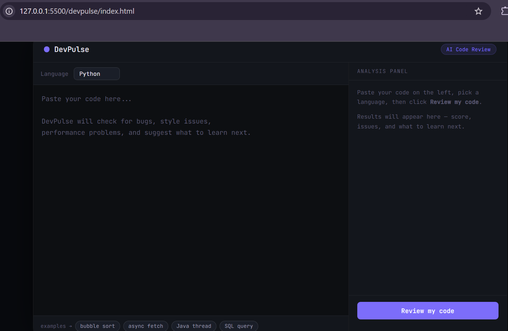

# DevPulse ⚡

An AI-powered code review tool that analyzes your code for bugs, style issues, and performance problems — and tells you what to learn next.



## Features

- **Code quality score** out of 100
- **Skill level detection** — Beginner → Senior
- **Issue breakdown** — bugs, warnings, tips, and things done well
- **"What to learn next"** — personalized study suggestion
- Supports Python, Java, JavaScript, TypeScript, C++, SQL

## Project Structure

```
devpulse/
├── index.html     # Main UI
├── style.css      # Styling
├── app.js         # Core logic + AI wiring instructions
├── examples.js    # Sample code snippets
└── README.md
```

## Setup

This is a pure frontend project. Open `index.html` directly in a browser to see the UI.

### Connecting an AI backend

The review button calls `callAI()` in `app.js`. To make it functional, you need a backend that proxies to the Anthropic API (never expose API keys in frontend code).

**Step 1 — Create a backend endpoint** (Node/Express example):

```js
// server.js
const express = require('express');
const app = express();
app.use(express.json());

app.post('/api/review', async (req, res) => {
  const { code, language } = req.body;
  const response = await fetch('https://api.anthropic.com/v1/messages', {
    method: 'POST',
    headers: {
      'Content-Type': 'application/json',
      'x-api-key': process.env.ANTHROPIC_API_KEY,
      'anthropic-version': '2023-06-01'
    },
    body: JSON.stringify({
      model: 'claude-sonnet-4-20250514',
      max_tokens: 1000,
      messages: [{ role: 'user', content: buildPrompt(code, language) }]
    })
  });
  const data = await response.json();
  const text = data.content[0].text;
  res.json(JSON.parse(text));
});

app.listen(3000);
```

**Step 2 — Update `callAI()` in app.js:**

```js
async function callAI(code, language) {
  const res = await fetch('/api/review', {
    method: 'POST',
    headers: { 'Content-Type': 'application/json' },
    body: JSON.stringify({ code, language })
  });
  return res.json();
}
```

## Deploying

Works with any static host:
- **GitHub Pages** — push to `gh-pages` branch or enable Pages in repo settings
- **Netlify** — drag the folder into netlify.com/drop
- **Vercel** — `vercel` CLI in the project folder

## Tech Stack

- Vanilla HTML, CSS, JavaScript (no frameworks)
- JetBrains Mono + Sora (Google Fonts)
- Anthropic Claude API (via backend)

## Author

[Ishwari Patil](https://github.com/ishp6)
